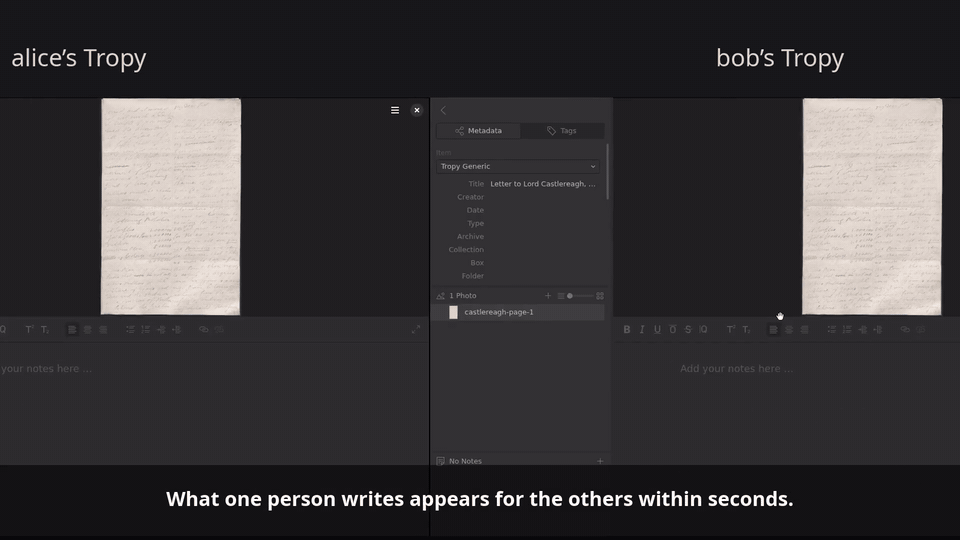

# Troparcel

> Written by an AI (Claude Opus 5.5). Tested against real Tropy, but not yet used by a group for real work. See [How far to trust it](#how-far-to-trust-it).

## The problem

[Tropy](https://tropy.org) is a free program for researchers who work with photos of archival material: letters, ledgers, photographs. You import your photos into a Tropy *project*, then describe them: titles and dates, tags, notes, transcriptions, marked regions.

A Tropy project belongs to one person on one computer. When several people research the same material, each one's notes stay in their own project. Nobody sees what the others found, unless someone exports files and someone else merges them by hand.

## What Troparcel does

Troparcel is a plugin that connects the projects of a group. When you add a note, a tag or a title, it appears in everyone else's project within seconds, and theirs appear in yours. Everyone keeps their own project and keeps working in Tropy as before. You can work offline; your work is sent when you reconnect, and nobody's work overwrites anyone else's.

[](docs/media/troparcel.mp4)

**[Watch the 68-second film](docs/media/troparcel.mp4)** of two real Tropys and a newcomer.

## How it works

**A room.** The group shares a *room*: one place where each member's Troparcel writes what they add, and reads what the others added. A room can merge changes that several people make at the same moment, so nothing is lost and nobody waits for anyone.

**Where the room lives.** Either in a folder you already sync between computers (Nextcloud, Dropbox, Google Drive, Syncthing), or on a small Troparcel server that one person in the group runs. A shared folder needs nothing new; a server is faster and shows who is online.

**An invite.** To join, a member pastes an *invite* into Troparcel: a short line such as `troparcel://folder/tropy-letters`. It says where the room is. One invite works for the whole group.

**Your name.** Each member chooses a name. Others see it on everything you add: your notes end with "— alice", and items you worked on get a tag `@alice`.

**Matching items.** Troparcel knows that alice's item and bob's are the same one because they hold the same photo files. So everyone imports the same files, or, in a *project room*, Troparcel brings the photos to the members who lack them.

## Get started

You need Tropy 1.17 or later, opened at least once, and [Node.js](https://nodejs.org) for the installer.

**1. Install.** In a terminal:

```bash
npx github:micahchoo/Troparcel install
```

It finds Tropy on your computer (also the Flatpak version on Linux) and installs Troparcel. Restart Tropy.

No Node.js? Download `troparcel.zip` from the [releases page](https://github.com/micahchoo/Troparcel/releases), choose **Help › Show Plugins Folder** in Tropy, extract the zip there, and restart Tropy. (The current release, 6.0.0, does not have the setup page yet; the next one will.)

**2. Set up.** When Tropy starts, a setup page opens in your browser. The example below shows what to do on it.

That is all. Later, **File › Export › Troparcel** in Tropy opens the same page: it shows whether sync works, who is online, what arrived, anything that needs a decision, and the invite for new members.

## Example: two people and a Nextcloud folder

Ada and Ben transcribe the same box of letters. Both have Nextcloud on their computers, so Nextcloud keeps a folder `~/Nextcloud` the same on both. The steps are the same for Dropbox, Google Drive, OneDrive or Syncthing.

**Ada starts the room.**

1. Ada installs Troparcel and restarts Tropy. The setup page opens.
2. Under **Your name**, Ada types `ada`. Others see this name on Ada's work.
3. Under **Start a new room**, Ada chooses **In: Nextcloud**, types the room name `tropy-letters` and clicks **Start the room**. Troparcel makes the folder `~/Nextcloud/tropy-letters`. The room is the files in it.
4. In Nextcloud, Ada shares the folder `tropy-letters` with Ben, and lets Ben **edit** it. With a read-only share, Ben receives Ada's work but cannot send any.
5. The page now shows the invite:

   ```
   troparcel://folder/tropy-letters
   ```

   Ada clicks **Copy** and sends it to Ben by email or chat.

**Ben joins.**

1. Ben accepts the share in Nextcloud, and waits until the folder `tropy-letters` is in the `~/Nextcloud` folder on Ben's computer. (A subfolder such as `~/Nextcloud/Shared/tropy-letters` is also found. In Google Drive, add the shared folder to **My Drive** first: Drive does not copy **Shared with me** to the computer.)
2. Ben installs Troparcel and restarts Tropy. On the setup page, Ben types `ben` under **Your name**, pastes the invite under **Join a group** and clicks **Join**.

**They work.** Both import the same photos into their own Tropy projects. When Ada adds a note to a letter, the note appears on the same letter in Ben's project, ending "— ada". It arrives when Nextcloud has copied the room folder to Ben's computer.

**Paste the invite, not a link.** Three other addresses look similar, and the page tells you which one you pasted:

| You pasted | It is | Paste instead |
|---|---|---|
| `https://cloud.example.org/s/aB3dE` | Nextcloud's share link | Accept the share first, then paste the invite |
| `http://127.0.0.1:41234/…` | The setup page's own address | The invite |
| `https://troparcel.example.org` | A server's web address | The invite, which the person who runs the server has |

An invite always starts with `troparcel://`.

The [Group Guide](docs/GUIDE.md) covers the other setups (a server on your network or on the internet) and what a group should agree on.

## Choose a kind of room

| Room | Photos | Choose it when |
|---|---|---|
| **Shared notes** (the default) | Stay on each computer. Everyone imports the same files | Your photos may not be copied, for example under archive rules |
| **Project room** | Travel with the room. A newcomer can start from an empty project | The group may share its photos |
| **Private room** | Encrypted: the server or folder holds nothing it can read | Others run the server or the sync service |

The setup page and the Group Guide show how to make each one.

## What is shared

Shared: titles, dates and other fields; tags; notes; marked regions (selections); transcriptions; templates you made. If you turn them on: lists, fields on photos and regions, and what you delete. In a project room, also the photo files.

Never shared: where files are on your computer, your Tropy settings, and the marks Troparcel adds for you (`@name` tags, the **Troparcel: received** list).

Before Troparcel changes anything in your project, it saves a copy of what it will change, in `~/.troparcel/backups/`.

## When two people change the same thing

- **Notes, regions and transcriptions** never overwrite each other: everyone's stay side by side. Only the person who wrote one can remove it for the others.
- **A field** (a title, a date): each field merges on its own. If you and someone else change the same one before either sees the other's change, both values are kept, one in each project, and Troparcel's page asks you which to use.
- **Tags:** adding beats removing. Names match regardless of capitals.

[docs/CONFLICTS.md](docs/CONFLICTS.md) has the exact rules.

## Is it safe?

- **The room is closed** to anyone without the invite (a server room has a password in it).
- **Your work is signed** with a key made on your computer: nobody can remove your notes for the group or write in your name, even with the invite.
- **A private room is encrypted** on your computer before anything leaves it, photos included.
- **Notes from others are cleaned** before they reach Tropy: only formatting Tropy's editor knows gets through.
- Over the internet, run the server behind HTTPS; the [Group Guide](docs/GUIDE.md) shows how.

## Publish your work as IIIF

When the work is ready to show, Troparcel can turn selected items into [IIIF](https://iiif.io), the format museum and library viewers read: each photo a page, each note and transcription an annotation, a note on a region placed on it. Add a second Troparcel entry in **Preferences › Plugins**, set **Publish as IIIF to** and **IIIF web address**, then use **File › Export** with it.

## How far to trust it

Each item below has run in real Tropy, started by the test suite:

- every kind of data travels both ways, once, and Tropy saves it;
- a newcomer sets Troparcel up from the setup page, and settings take effect without restarting Tropy;
- an empty project receives a whole project room, encrypted or not;
- a forged deletion is ignored and repaired;
- a 10,000-item project starts syncing 1.5 s after it opens.

Not yet checked:

- **use by real people.** No group has used it for real work. Long automated runs (several Tropys making random changes for an hour, with restarts and outages) stand in for that. They have found and fixed real bugs, and runs continue;
- a published IIIF folder in an actual viewer.

The released version, [6.0.0](https://github.com/micahchoo/Troparcel/releases/tag/v6.0.0), lacks the setup page, project and private rooms, signing and IIIF. The installer installs the current version. **Upgrade a whole group at once:** a room written by 6.x cannot be read by 5.x.

## For developers

```bash
npm install
npm test        # unit, scenario and integration tests
npm run e2e     # real Tropy instances, headless (Flatpak); see test/README.md
npm run soak    # an hour of random changes, restarts and outages
npm run film    # record the explainer from real Tropy
```

[docs/DEVELOPER.md](docs/DEVELOPER.md) explains the design, [ROADMAP.md](ROADMAP.md) the plan, [docs/CHANGELOG.md](docs/CHANGELOG.md) the changes.

## License

[AGPL-3.0](LICENSE)
